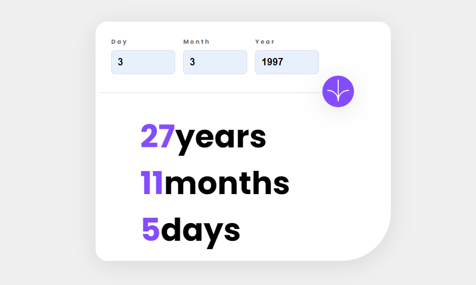

## Welcome! 👋

# Frontend Mentor - Age calculator app solution

This is a solution to the [Age calculator app challenge on Frontend Mentor](https://www.frontendmentor.io/challenges/age-calculator-app-dF9DFFpj-Q). Frontend Mentor challenges help you improve your coding skills by building realistic projects. 

## Table of contents

- [Overview](#overview)
  - [The challenge](#the-challenge)
  - [Screenshot](#screenshot)
  - [Links](#links)
  - [Built with](#built-with)
  - [What I learned](#what-i-learned)
- [Author](#author)


## Overview

### The challenge

The challenge was to build a responsive age calculator application that allows users to input their date of birth and displays their age in years, months, and days. The application had to handle various validation scenarios, such as empty fields, invalid dates, and dates in the future.

### Key Features

- Seamless user experience with real-time validation and error handling
- Visually appealing and responsive design, optimized for both desktop and mobile
- Smooth animation of the age output when the form is submitted
- Robust JavaScript logic to accurately calculate the user's age

### Screenshot



### Links

- Solution URL: [Add solution URL here](https://your-solution-url.com)
- Live Site URL: [ahmedbernawi.github.io](https://ahmedbernawi.github.io/age-calculator-app/)

## My process

### Built with

- Semantic HTML5 markup
- CSS custom properties
- Flexbox and CSS Grid
- Mobile-first workflow
- Vanilla JavaScript


### What I learned
Throughout this project, I gained valuable insights and learned several new techniques. One aspect I'm particularly proud of is the JavaScript logic for calculating the user's age:

```html
<h1>Some JavaScript code I'm proud of</h1>
```
```JavaScript
if (months < 0 || (months === 0 && days < 0)) {
years--;
months += 12;
}

if (days < 0) {
const prevMonth = new Date(today.getFullYear(), today.getMonth(), 0);
days += prevMonth.getDate();
months--;
}

dayOutput.textContent = days;
monthOutput.textContent = months;
yearOutput.textContent = years;

```

## Author
- Frontend Mentor - [ahmedbernawi](https://www.frontendmentor.io/profile/ahmedbernawi)
